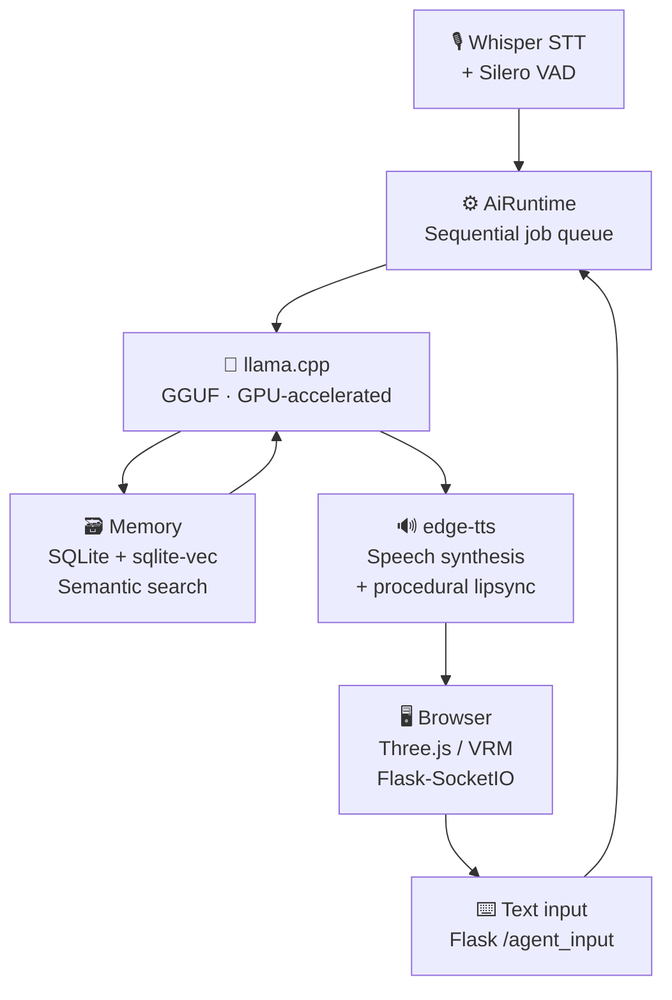

# 3D AI Companion Core

Ein modularer, vollständig lokal laufender KI-Begleiter (Edge-AI) mit einem interaktiven 3D-Avatar im Browser. Das System kombiniert modernste Sprach- und Textverarbeitung mit prozeduraler Animation und einem datenschutzkonformen Langzeitgedächtnis. 

Dieses Framework ist so konzipiert, dass es unabhängig vom genutzten Charakter-Sheet oder LLM-Modell funktioniert und vollständig über eine zentrale Konfigurationsdatei gesteuert werden kann.

## 🚀 Kern-Features

- **3D-Avatar-Pipeline (Three.js):** Echtzeit-Rendering und Animation von Standard-VRM-Modellen direkt in einer Webview-Umgebung.
- **Flüssige prozedurale Animation:** Mathematisch berechnetes Blinzeln, lebendige Kopfbewegungen und visembasierter Lipsync (Lippensynchronisation) synchron zur Audioausgabe.
- **Thread-Sichere Runtime (Sequenzielle Queue):** Eine robuste Hintergrund-Queue fängt asynchrone Eingaben (gleichzeitiges Sprechen und Tippen) ab und verarbeitet sie stabil nacheinander, um Race Conditions in der Chat-History zu verhindern.
- **High-Performance LLM-Inferenz:** Direkte Integration von `llama.cpp` zur hocheffizienten Ausführung von GGUF-Modellen (z. B. Llama 3.1 / Stheno) mit nativer VRAM-Auslastung.
- **Lokales RAG (Langzeitgedächtnis):** SQLite3-Datenbank mit Vektorerweiterung und lokalem Sentence-Transformer-Embedding zur intelligenten, semantischen Faktenerkennung.
- **High-End Audio-Pipeline:** Integrierte Silero Voice Activity Detection (VAD) für präzise Pausenerkennung beim Sprechen und Whisper für lokales Speech-to-Text (STT).
- **Modernes WebSocket-Interface:** Ultra-niedrige Latenzzeiten bei der Übertragung von Mundbewegungen, Untertiteln und Modus-Wechseln zwischen Backend und Frontend via Flask-SocketIO.
- **Hybrid Interface:** Nahtloser "Mode Switch" zwischen flüssiger Sprachsteuerung (Normal-Modus) und diskreter Texteingabe (Agent-Modus).

## 🏗️ Systemarchitektur

## 🏗️ Systemarchitektur




## 📋 Voraussetzungen & Hardware

Das Framework ist ressourceneffizient optimiert und passt sich flexibel an die Hardware an:
- **Mit GPU-Beschleunigung (Empfohlen):** NVIDIA-Grafikkarte (z. B. RTX-Serie ab 6GB+ VRAM) für parallele LLM-, Whisper- und Kokoro-Ausführung im Grafikspeicher.
- **CPU-Fallback:** Dank `llama.cpp` können die GGUF-Modelle bei geringem VRAM direkt über den normalen Arbeitsspeicher (RAM) ausgeführt werden.

## 🔧 Installation & Setup

1. **Repository klonen:**
   ```bash
   git clone https://github.com
   cd DEIN_REPO_NAME
   ```

2. **Virtuelle Umgebung erstellen & aktivieren:**
   ```bash
   python -m venv venv
   # Unter Windows (CMD):
   venv\Scripts\activate
   # Unter Linux/Mac:
   source venv/bin/activate
   ```

3. **Abhängigkeiten installieren:**
   ```bash
   pip install -r requirements.txt
   ```

4. **Konfiguration einrichten:**
   Kopiere die Datei `config.example.yaml`, benenne sie in `config.yaml` um und füge dort deine Pfade, dein gewünschtes Charakter-Sheet sowie deine Parameter ein.

5. **Modelle & Assets hinterlegen (Wichtig):**
   Da große KI-Modelle nicht auf GitHub hochgeladen werden, müssen diese manuell im Projekt platziert werden:
   - **LLM-Modell:** Erstelle im Hauptverzeichnis einen Ordner namens `models/` und lege dort deine gewünschte `.gguf`-Datei ab. Passe den Pfad in der `config.yaml` an.
   - **3D-Avatar:** Platziere dein eigenes 3D-Modell im Ordner `webview/` unter dem Namen `avatar.vrm`.
   - **Animation:** Platziere deine Basis-Animationsdatei im Ordner `webview/` unter dem Namen `neutral.vrma`.

6. **Anwendung starten:**
   Starte das Python-Backend im Hauptverzeichnis:
   ```bash
   python main.py
   ```
   Öffne anschließend die `index.html` im Ordner `webview/` im Browser deiner Wahl, um das 3D-Interface zu starten.
