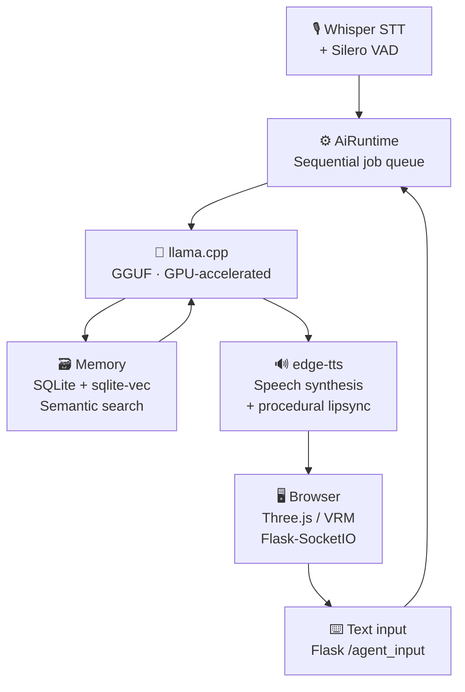

# 3D AI Companion Core

Ein modularer, vollständig lokal laufender KI-Begleiter (Edge-AI) mit einem interaktiven 3D-Avatar im Browser. Das System kombiniert modernste Sprach- und Textverarbeitung mit prozeduraler Animation und einem datenschutzkonformen Langzeitgedächtnis. 

Dieses Framework ist so konzipiert, dass es unabhängig vom genutzten Charakter-Sheet oder LLM-Modell funktioniert und vollständig über eine zentrale Konfigurationsdatei gesteuert werden kann.

## 🚀 Kern-Features

- **3D-Avatar-Pipeline (Three.js):** Echtzeit-Rendering und Animation von Standard-VRM-Modellen direkt in einer Webview-Umgebung.
- **Flüssige prozedurale Animation:** Mathematisch berechnetes Blinzeln, lebendige Kopfbewegungen und visembasierter Lipsync (Lippensynchronisation) synchron zur Audioausgabe.
- **Thread-Sichere Runtime (Sequenzielle Queue):** Eine robuste Hintergrund-Queue fängt asynchrone Eingaben (gleichzeitiges Sprechen und Tippen) ab und verarbeitet sie stabil nacheinander, um Race Conditions in der Chat-History zu verhindern.
- **High-Performance LLM-Inferenz:** Direkte Integration von `llama.cpp` zur hocheffizienten Ausführung von GGUF-Modellen (z. B. Llama 3.1 / Stheno) mit nativer VRAM-Auslastung.
- **Lokales RAG (Langzeitgedächtnis):** SQLite3-Datenbank mit Vektorerweiterung und lokalem Sentence-Transformer-Embedding zur intelligenten, semantischen Faktenerkennung.
- **High-End Audio-Pipeline:** Integrierte Silero Voice Activity Detection (VAD) für präzise Pausenerkennung beim Sprechen und Whisper für lokales Speech-to-Text (STT).
- **Modernes WebSocket-Interface:** Ultra-niedrige Latenzzeiten bei der Übertragung von Mundbewegungen, Untertiteln und Modus-Wechseln zwischen Backend und Frontend via Flask-SocketIO.
- **Hybrid Interface:** Nahtloser "Mode Switch" zwischen flüssiger Sprachsteuerung (Normal-Modus) und diskreter Texteingabe (Agent-Modus).

## 🏗️ Systemarchitektur
<svg width="100%" viewBox="0 0 680 520" role="img" style="" xmlns="http://www.w3.org/2000/svg">
<title style="fill:rgb(0, 0, 0);stroke:none;color:rgb(11, 11, 11);stroke-width:1px;stroke-linecap:butt;stroke-linejoin:miter;opacity:1;font-family:&quot;Anthropic Sans&quot;, -apple-system, BlinkMacSystemFont, &quot;Segoe UI&quot;, sans-serif;font-size:16px;font-weight:400;text-anchor:start;dominant-baseline:auto">3D AI Companion Core – Systemarchitektur</title>
<desc style="fill:rgb(0, 0, 0);stroke:none;color:rgb(11, 11, 11);stroke-width:1px;stroke-linecap:butt;stroke-linejoin:miter;opacity:1;font-family:&quot;Anthropic Sans&quot;, -apple-system, BlinkMacSystemFont, &quot;Segoe UI&quot;, sans-serif;font-size:16px;font-weight:400;text-anchor:start;dominant-baseline:auto">Flowchart der Systemarchitektur: Sprach- und Texteingabe fließen über eine zentrale Runtime-Queue in das LLM, Memory und TTS, und die Ausgabe geht ans Browser-Frontend.</desc>
<defs>
<marker id="arrow" viewBox="0 0 10 10" refX="8" refY="5" markerWidth="6" markerHeight="6" orient="auto-start-reverse">
<path d="M2 1L8 5L2 9" fill="none" stroke="context-stroke" stroke-width="1.5" stroke-linecap="round" stroke-linejoin="round"/>
</marker>
</defs>


<g style="fill:rgb(0, 0, 0);stroke:none;color:rgb(11, 11, 11);stroke-width:1px;stroke-linecap:butt;stroke-linejoin:miter;opacity:1;font-family:&quot;Anthropic Sans&quot;, -apple-system, BlinkMacSystemFont, &quot;Segoe UI&quot;, sans-serif;font-size:16px;font-weight:400;text-anchor:start;dominant-baseline:auto">
<rect x="40" y="40" width="150" height="56" rx="8" stroke-width="0.5" style="fill:rgb(225, 245, 238);stroke:rgb(15, 110, 86);color:rgb(11, 11, 11);stroke-width:0.5px;stroke-linecap:butt;stroke-linejoin:miter;opacity:1;font-family:&quot;Anthropic Sans&quot;, -apple-system, BlinkMacSystemFont, &quot;Segoe UI&quot;, sans-serif;font-size:16px;font-weight:400;text-anchor:start;dominant-baseline:auto"/>
<text x="115" y="60" text-anchor="middle" dominant-baseline="central" style="fill:rgb(8, 80, 65);stroke:none;color:rgb(11, 11, 11);stroke-width:1px;stroke-linecap:butt;stroke-linejoin:miter;opacity:1;font-family:&quot;Anthropic Sans&quot;, -apple-system, BlinkMacSystemFont, &quot;Segoe UI&quot;, sans-serif;font-size:14px;font-weight:500;text-anchor:middle;dominant-baseline:central">Whisper STT</text>
<text x="115" y="80" text-anchor="middle" dominant-baseline="central" style="fill:rgb(15, 110, 86);stroke:none;color:rgb(11, 11, 11);stroke-width:1px;stroke-linecap:butt;stroke-linejoin:miter;opacity:1;font-family:&quot;Anthropic Sans&quot;, -apple-system, BlinkMacSystemFont, &quot;Segoe UI&quot;, sans-serif;font-size:12px;font-weight:400;text-anchor:middle;dominant-baseline:central">+ Silero VAD</text>
</g>

<g style="fill:rgb(0, 0, 0);stroke:none;color:rgb(11, 11, 11);stroke-width:1px;stroke-linecap:butt;stroke-linejoin:miter;opacity:1;font-family:&quot;Anthropic Sans&quot;, -apple-system, BlinkMacSystemFont, &quot;Segoe UI&quot;, sans-serif;font-size:16px;font-weight:400;text-anchor:start;dominant-baseline:auto">
<rect x="40" y="120" width="150" height="56" rx="8" stroke-width="0.5" style="fill:rgb(225, 245, 238);stroke:rgb(15, 110, 86);color:rgb(11, 11, 11);stroke-width:0.5px;stroke-linecap:butt;stroke-linejoin:miter;opacity:1;font-family:&quot;Anthropic Sans&quot;, -apple-system, BlinkMacSystemFont, &quot;Segoe UI&quot;, sans-serif;font-size:16px;font-weight:400;text-anchor:start;dominant-baseline:auto"/>
<text x="115" y="140" text-anchor="middle" dominant-baseline="central" style="fill:rgb(8, 80, 65);stroke:none;color:rgb(11, 11, 11);stroke-width:1px;stroke-linecap:butt;stroke-linejoin:miter;opacity:1;font-family:&quot;Anthropic Sans&quot;, -apple-system, BlinkMacSystemFont, &quot;Segoe UI&quot;, sans-serif;font-size:14px;font-weight:500;text-anchor:middle;dominant-baseline:central">Text input</text>
<text x="115" y="160" text-anchor="middle" dominant-baseline="central" style="fill:rgb(15, 110, 86);stroke:none;color:rgb(11, 11, 11);stroke-width:1px;stroke-linecap:butt;stroke-linejoin:miter;opacity:1;font-family:&quot;Anthropic Sans&quot;, -apple-system, BlinkMacSystemFont, &quot;Segoe UI&quot;, sans-serif;font-size:12px;font-weight:400;text-anchor:middle;dominant-baseline:central">Flask /agent_input</text>
</g>


<line x1="190" y1="68" x2="248" y2="120" marker-end="url(#arrow)" style="fill:none;stroke:rgb(137, 135, 129);color:rgb(11, 11, 11);stroke-width:1.5px;stroke-linecap:butt;stroke-linejoin:miter;opacity:1;font-family:&quot;Anthropic Sans&quot;, -apple-system, BlinkMacSystemFont, &quot;Segoe UI&quot;, sans-serif;font-size:16px;font-weight:400;text-anchor:start;dominant-baseline:auto"/>
<line x1="190" y1="148" x2="248" y2="148" marker-end="url(#arrow)" style="fill:none;stroke:rgb(137, 135, 129);color:rgb(11, 11, 11);stroke-width:1.5px;stroke-linecap:butt;stroke-linejoin:miter;opacity:1;font-family:&quot;Anthropic Sans&quot;, -apple-system, BlinkMacSystemFont, &quot;Segoe UI&quot;, sans-serif;font-size:16px;font-weight:400;text-anchor:start;dominant-baseline:auto"/>


<g style="fill:rgb(0, 0, 0);stroke:none;color:rgb(11, 11, 11);stroke-width:1px;stroke-linecap:butt;stroke-linejoin:miter;opacity:1;font-family:&quot;Anthropic Sans&quot;, -apple-system, BlinkMacSystemFont, &quot;Segoe UI&quot;, sans-serif;font-size:16px;font-weight:400;text-anchor:start;dominant-baseline:auto">
<rect x="250" y="100" width="180" height="96" rx="8" stroke-width="0.5" style="fill:rgb(238, 237, 254);stroke:rgb(83, 74, 183);color:rgb(11, 11, 11);stroke-width:0.5px;stroke-linecap:butt;stroke-linejoin:miter;opacity:1;font-family:&quot;Anthropic Sans&quot;, -apple-system, BlinkMacSystemFont, &quot;Segoe UI&quot;, sans-serif;font-size:16px;font-weight:400;text-anchor:start;dominant-baseline:auto"/>
<text x="340" y="130" text-anchor="middle" dominant-baseline="central" style="fill:rgb(60, 52, 137);stroke:none;color:rgb(11, 11, 11);stroke-width:1px;stroke-linecap:butt;stroke-linejoin:miter;opacity:1;font-family:&quot;Anthropic Sans&quot;, -apple-system, BlinkMacSystemFont, &quot;Segoe UI&quot;, sans-serif;font-size:14px;font-weight:500;text-anchor:middle;dominant-baseline:central">AiRuntime</text>
<text x="340" y="152" text-anchor="middle" dominant-baseline="central" style="fill:rgb(83, 74, 183);stroke:none;color:rgb(11, 11, 11);stroke-width:1px;stroke-linecap:butt;stroke-linejoin:miter;opacity:1;font-family:&quot;Anthropic Sans&quot;, -apple-system, BlinkMacSystemFont, &quot;Segoe UI&quot;, sans-serif;font-size:12px;font-weight:400;text-anchor:middle;dominant-baseline:central">Sequential job queue</text>
<text x="340" y="172" text-anchor="middle" dominant-baseline="central" style="fill:rgb(83, 74, 183);stroke:none;color:rgb(11, 11, 11);stroke-width:1px;stroke-linecap:butt;stroke-linejoin:miter;opacity:1;font-family:&quot;Anthropic Sans&quot;, -apple-system, BlinkMacSystemFont, &quot;Segoe UI&quot;, sans-serif;font-size:12px;font-weight:400;text-anchor:middle;dominant-baseline:central">No race conditions</text>
</g>


<line x1="430" y1="148" x2="488" y2="148" marker-end="url(#arrow)" style="fill:none;stroke:rgb(137, 135, 129);color:rgb(11, 11, 11);stroke-width:1.5px;stroke-linecap:butt;stroke-linejoin:miter;opacity:1;font-family:&quot;Anthropic Sans&quot;, -apple-system, BlinkMacSystemFont, &quot;Segoe UI&quot;, sans-serif;font-size:16px;font-weight:400;text-anchor:start;dominant-baseline:auto"/>


<g style="fill:rgb(0, 0, 0);stroke:none;color:rgb(11, 11, 11);stroke-width:1px;stroke-linecap:butt;stroke-linejoin:miter;opacity:1;font-family:&quot;Anthropic Sans&quot;, -apple-system, BlinkMacSystemFont, &quot;Segoe UI&quot;, sans-serif;font-size:16px;font-weight:400;text-anchor:start;dominant-baseline:auto">
<rect x="490" y="100" width="150" height="96" rx="8" stroke-width="0.5" style="fill:rgb(250, 236, 231);stroke:rgb(153, 60, 29);color:rgb(11, 11, 11);stroke-width:0.5px;stroke-linecap:butt;stroke-linejoin:miter;opacity:1;font-family:&quot;Anthropic Sans&quot;, -apple-system, BlinkMacSystemFont, &quot;Segoe UI&quot;, sans-serif;font-size:16px;font-weight:400;text-anchor:start;dominant-baseline:auto"/>
<text x="565" y="130" text-anchor="middle" dominant-baseline="central" style="fill:rgb(113, 43, 19);stroke:none;color:rgb(11, 11, 11);stroke-width:1px;stroke-linecap:butt;stroke-linejoin:miter;opacity:1;font-family:&quot;Anthropic Sans&quot;, -apple-system, BlinkMacSystemFont, &quot;Segoe UI&quot;, sans-serif;font-size:14px;font-weight:500;text-anchor:middle;dominant-baseline:central">llama.cpp</text>
<text x="565" y="152" text-anchor="middle" dominant-baseline="central" style="fill:rgb(153, 60, 29);stroke:none;color:rgb(11, 11, 11);stroke-width:1px;stroke-linecap:butt;stroke-linejoin:miter;opacity:1;font-family:&quot;Anthropic Sans&quot;, -apple-system, BlinkMacSystemFont, &quot;Segoe UI&quot;, sans-serif;font-size:12px;font-weight:400;text-anchor:middle;dominant-baseline:central">GGUF model</text>
<text x="565" y="172" text-anchor="middle" dominant-baseline="central" style="fill:rgb(153, 60, 29);stroke:none;color:rgb(11, 11, 11);stroke-width:1px;stroke-linecap:butt;stroke-linejoin:miter;opacity:1;font-family:&quot;Anthropic Sans&quot;, -apple-system, BlinkMacSystemFont, &quot;Segoe UI&quot;, sans-serif;font-size:12px;font-weight:400;text-anchor:middle;dominant-baseline:central">GPU-accelerated</text>
</g>


<line x1="565" y1="196" x2="565" y2="248" marker-end="url(#arrow)" style="fill:none;stroke:rgb(137, 135, 129);color:rgb(11, 11, 11);stroke-width:1.5px;stroke-linecap:butt;stroke-linejoin:miter;opacity:1;font-family:&quot;Anthropic Sans&quot;, -apple-system, BlinkMacSystemFont, &quot;Segoe UI&quot;, sans-serif;font-size:16px;font-weight:400;text-anchor:start;dominant-baseline:auto"/>


<g style="fill:rgb(0, 0, 0);stroke:none;color:rgb(11, 11, 11);stroke-width:1px;stroke-linecap:butt;stroke-linejoin:miter;opacity:1;font-family:&quot;Anthropic Sans&quot;, -apple-system, BlinkMacSystemFont, &quot;Segoe UI&quot;, sans-serif;font-size:16px;font-weight:400;text-anchor:start;dominant-baseline:auto">
<rect x="490" y="250" width="150" height="96" rx="8" stroke-width="0.5" style="fill:rgb(250, 238, 218);stroke:rgb(133, 79, 11);color:rgb(11, 11, 11);stroke-width:0.5px;stroke-linecap:butt;stroke-linejoin:miter;opacity:1;font-family:&quot;Anthropic Sans&quot;, -apple-system, BlinkMacSystemFont, &quot;Segoe UI&quot;, sans-serif;font-size:16px;font-weight:400;text-anchor:start;dominant-baseline:auto"/>
<text x="565" y="278" text-anchor="middle" dominant-baseline="central" style="fill:rgb(99, 56, 6);stroke:none;color:rgb(11, 11, 11);stroke-width:1px;stroke-linecap:butt;stroke-linejoin:miter;opacity:1;font-family:&quot;Anthropic Sans&quot;, -apple-system, BlinkMacSystemFont, &quot;Segoe UI&quot;, sans-serif;font-size:14px;font-weight:500;text-anchor:middle;dominant-baseline:central">Memory</text>
<text x="565" y="300" text-anchor="middle" dominant-baseline="central" style="fill:rgb(133, 79, 11);stroke:none;color:rgb(11, 11, 11);stroke-width:1px;stroke-linecap:butt;stroke-linejoin:miter;opacity:1;font-family:&quot;Anthropic Sans&quot;, -apple-system, BlinkMacSystemFont, &quot;Segoe UI&quot;, sans-serif;font-size:12px;font-weight:400;text-anchor:middle;dominant-baseline:central">SQLite + sqlite-vec</text>
<text x="565" y="320" text-anchor="middle" dominant-baseline="central" style="fill:rgb(133, 79, 11);stroke:none;color:rgb(11, 11, 11);stroke-width:1px;stroke-linecap:butt;stroke-linejoin:miter;opacity:1;font-family:&quot;Anthropic Sans&quot;, -apple-system, BlinkMacSystemFont, &quot;Segoe UI&quot;, sans-serif;font-size:12px;font-weight:400;text-anchor:middle;dominant-baseline:central">Semantic search</text>
</g>


<path d="M490 298 L460 298 L460 148 L490 148" fill="none" marker-end="url(#arrow)" style="fill:none;stroke:rgb(137, 135, 129);color:rgb(11, 11, 11);stroke-width:1.5px;stroke-linecap:butt;stroke-linejoin:miter;opacity:1;font-family:&quot;Anthropic Sans&quot;, -apple-system, BlinkMacSystemFont, &quot;Segoe UI&quot;, sans-serif;font-size:16px;font-weight:400;text-anchor:start;dominant-baseline:auto"/>


<line x1="340" y1="196" x2="340" y2="330" marker-end="url(#arrow)" style="fill:none;stroke:rgb(137, 135, 129);color:rgb(11, 11, 11);stroke-width:1.5px;stroke-linecap:butt;stroke-linejoin:miter;opacity:1;font-family:&quot;Anthropic Sans&quot;, -apple-system, BlinkMacSystemFont, &quot;Segoe UI&quot;, sans-serif;font-size:16px;font-weight:400;text-anchor:start;dominant-baseline:auto"/>


<g style="fill:rgb(0, 0, 0);stroke:none;color:rgb(11, 11, 11);stroke-width:1px;stroke-linecap:butt;stroke-linejoin:miter;opacity:1;font-family:&quot;Anthropic Sans&quot;, -apple-system, BlinkMacSystemFont, &quot;Segoe UI&quot;, sans-serif;font-size:16px;font-weight:400;text-anchor:start;dominant-baseline:auto">
<rect x="250" y="332" width="180" height="96" rx="8" stroke-width="0.5" style="fill:rgb(225, 245, 238);stroke:rgb(15, 110, 86);color:rgb(11, 11, 11);stroke-width:0.5px;stroke-linecap:butt;stroke-linejoin:miter;opacity:1;font-family:&quot;Anthropic Sans&quot;, -apple-system, BlinkMacSystemFont, &quot;Segoe UI&quot;, sans-serif;font-size:16px;font-weight:400;text-anchor:start;dominant-baseline:auto"/>
<text x="340" y="362" text-anchor="middle" dominant-baseline="central" style="fill:rgb(8, 80, 65);stroke:none;color:rgb(11, 11, 11);stroke-width:1px;stroke-linecap:butt;stroke-linejoin:miter;opacity:1;font-family:&quot;Anthropic Sans&quot;, -apple-system, BlinkMacSystemFont, &quot;Segoe UI&quot;, sans-serif;font-size:14px;font-weight:500;text-anchor:middle;dominant-baseline:central">edge-tts</text>
<text x="340" y="384" text-anchor="middle" dominant-baseline="central" style="fill:rgb(15, 110, 86);stroke:none;color:rgb(11, 11, 11);stroke-width:1px;stroke-linecap:butt;stroke-linejoin:miter;opacity:1;font-family:&quot;Anthropic Sans&quot;, -apple-system, BlinkMacSystemFont, &quot;Segoe UI&quot;, sans-serif;font-size:12px;font-weight:400;text-anchor:middle;dominant-baseline:central">Speech synthesis</text>
<text x="340" y="404" text-anchor="middle" dominant-baseline="central" style="fill:rgb(15, 110, 86);stroke:none;color:rgb(11, 11, 11);stroke-width:1px;stroke-linecap:butt;stroke-linejoin:miter;opacity:1;font-family:&quot;Anthropic Sans&quot;, -apple-system, BlinkMacSystemFont, &quot;Segoe UI&quot;, sans-serif;font-size:12px;font-weight:400;text-anchor:middle;dominant-baseline:central">+ procedural lipsync</text>
</g>


<line x1="250" y1="380" x2="192" y2="380" marker-end="url(#arrow)" style="fill:none;stroke:rgb(137, 135, 129);color:rgb(11, 11, 11);stroke-width:1.5px;stroke-linecap:butt;stroke-linejoin:miter;opacity:1;font-family:&quot;Anthropic Sans&quot;, -apple-system, BlinkMacSystemFont, &quot;Segoe UI&quot;, sans-serif;font-size:16px;font-weight:400;text-anchor:start;dominant-baseline:auto"/>


<g style="fill:rgb(0, 0, 0);stroke:none;color:rgb(11, 11, 11);stroke-width:1px;stroke-linecap:butt;stroke-linejoin:miter;opacity:1;font-family:&quot;Anthropic Sans&quot;, -apple-system, BlinkMacSystemFont, &quot;Segoe UI&quot;, sans-serif;font-size:16px;font-weight:400;text-anchor:start;dominant-baseline:auto">
<rect x="40" y="332" width="150" height="96" rx="8" stroke-width="0.5" style="fill:rgb(241, 239, 232);stroke:rgb(95, 94, 90);color:rgb(11, 11, 11);stroke-width:0.5px;stroke-linecap:butt;stroke-linejoin:miter;opacity:1;font-family:&quot;Anthropic Sans&quot;, -apple-system, BlinkMacSystemFont, &quot;Segoe UI&quot;, sans-serif;font-size:16px;font-weight:400;text-anchor:start;dominant-baseline:auto"/>
<text x="115" y="362" text-anchor="middle" dominant-baseline="central" style="fill:rgb(68, 68, 65);stroke:none;color:rgb(11, 11, 11);stroke-width:1px;stroke-linecap:butt;stroke-linejoin:miter;opacity:1;font-family:&quot;Anthropic Sans&quot;, -apple-system, BlinkMacSystemFont, &quot;Segoe UI&quot;, sans-serif;font-size:14px;font-weight:500;text-anchor:middle;dominant-baseline:central">Browser</text>
<text x="115" y="384" text-anchor="middle" dominant-baseline="central" style="fill:rgb(95, 94, 90);stroke:none;color:rgb(11, 11, 11);stroke-width:1px;stroke-linecap:butt;stroke-linejoin:miter;opacity:1;font-family:&quot;Anthropic Sans&quot;, -apple-system, BlinkMacSystemFont, &quot;Segoe UI&quot;, sans-serif;font-size:12px;font-weight:400;text-anchor:middle;dominant-baseline:central">Three.js / VRM</text>
<text x="115" y="404" text-anchor="middle" dominant-baseline="central" style="fill:rgb(95, 94, 90);stroke:none;color:rgb(11, 11, 11);stroke-width:1px;stroke-linecap:butt;stroke-linejoin:miter;opacity:1;font-family:&quot;Anthropic Sans&quot;, -apple-system, BlinkMacSystemFont, &quot;Segoe UI&quot;, sans-serif;font-size:12px;font-weight:400;text-anchor:middle;dominant-baseline:central">Flask-SocketIO</text>
</g>


<g style="fill:rgb(0, 0, 0);stroke:none;color:rgb(11, 11, 11);stroke-width:1px;stroke-linecap:butt;stroke-linejoin:miter;opacity:1;font-family:&quot;Anthropic Sans&quot;, -apple-system, BlinkMacSystemFont, &quot;Segoe UI&quot;, sans-serif;font-size:16px;font-weight:400;text-anchor:start;dominant-baseline:auto">
<rect x="250" y="470" width="180" height="40" rx="8" stroke-width="0.5" style="fill:rgb(241, 239, 232);stroke:rgb(95, 94, 90);color:rgb(11, 11, 11);stroke-width:0.5px;stroke-linecap:butt;stroke-linejoin:miter;opacity:1;font-family:&quot;Anthropic Sans&quot;, -apple-system, BlinkMacSystemFont, &quot;Segoe UI&quot;, sans-serif;font-size:16px;font-weight:400;text-anchor:start;dominant-baseline:auto"/>
<text x="340" y="490" text-anchor="middle" dominant-baseline="central" style="fill:rgb(68, 68, 65);stroke:none;color:rgb(11, 11, 11);stroke-width:1px;stroke-linecap:butt;stroke-linejoin:miter;opacity:1;font-family:&quot;Anthropic Sans&quot;, -apple-system, BlinkMacSystemFont, &quot;Segoe UI&quot;, sans-serif;font-size:14px;font-weight:500;text-anchor:middle;dominant-baseline:central">Flask HTTP server</text>
</g>
<line x1="340" y1="428" x2="340" y2="470" marker-end="url(#arrow)" style="fill:none;stroke:rgb(137, 135, 129);color:rgb(11, 11, 11);stroke-width:1.5px;stroke-linecap:butt;stroke-linejoin:miter;opacity:1;font-family:&quot;Anthropic Sans&quot;, -apple-system, BlinkMacSystemFont, &quot;Segoe UI&quot;, sans-serif;font-size:16px;font-weight:400;text-anchor:start;dominant-baseline:auto"/>
<line x1="250" y1="490" x2="192" y2="410" marker-end="url(#arrow)" style="fill:none;stroke:rgb(137, 135, 129);color:rgb(11, 11, 11);stroke-width:1.5px;stroke-linecap:butt;stroke-linejoin:miter;opacity:1;font-family:&quot;Anthropic Sans&quot;, -apple-system, BlinkMacSystemFont, &quot;Segoe UI&quot;, sans-serif;font-size:16px;font-weight:400;text-anchor:start;dominant-baseline:auto"/>

</svg>



## 📋 Voraussetzungen & Hardware

Das Framework ist ressourceneffizient optimiert und passt sich flexibel an die Hardware an:
- **Mit GPU-Beschleunigung (Empfohlen):** NVIDIA-Grafikkarte (z. B. RTX-Serie ab 6GB+ VRAM) für parallele LLM-, Whisper- und Kokoro-Ausführung im Grafikspeicher.
- **CPU-Fallback:** Dank `llama.cpp` können die GGUF-Modelle bei geringem VRAM direkt über den normalen Arbeitsspeicher (RAM) ausgeführt werden.

## 🔧 Installation & Setup

1. **Repository klonen:**
   ```bash
   git clone https://github.com
   cd DEIN_REPO_NAME
   ```

2. **Virtuelle Umgebung erstellen & aktivieren:**
   ```bash
   python -m venv venv
   # Unter Windows (CMD):
   venv\Scripts\activate
   # Unter Linux/Mac:
   source venv/bin/activate
   ```

3. **Abhängigkeiten installieren:**
   ```bash
   pip install -r requirements.txt
   ```

4. **Konfiguration einrichten:**
   Kopiere die Datei `config.example.yaml`, benenne sie in `config.yaml` um und füge dort deine Pfade, dein gewünschtes Charakter-Sheet sowie deine Parameter ein.

5. **Modelle & Assets hinterlegen (Wichtig):**
   Da große KI-Modelle nicht auf GitHub hochgeladen werden, müssen diese manuell im Projekt platziert werden:
   - **LLM-Modell:** Erstelle im Hauptverzeichnis einen Ordner namens `models/` und lege dort deine gewünschte `.gguf`-Datei ab. Passe den Pfad in der `config.yaml` an.
   - **3D-Avatar:** Platziere dein eigenes 3D-Modell im Ordner `webview/` unter dem Namen `avatar.vrm`.
   - **Animation:** Platziere deine Basis-Animationsdatei im Ordner `webview/` unter dem Namen `neutral.vrma`.

6. **Anwendung starten:**
   Starte das Python-Backend im Hauptverzeichnis:
   ```bash
   python main.py
   ```
   Öffne anschließend die `index.html` im Ordner `webview/` im Browser deiner Wahl, um das 3D-Interface zu starten.
