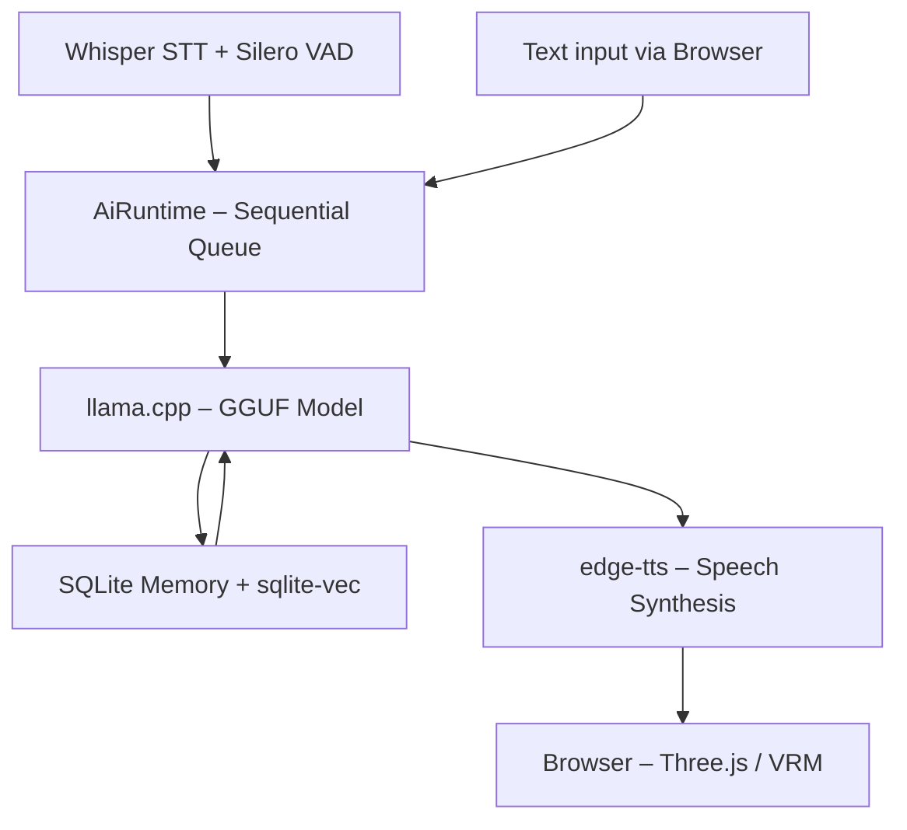

# 3D AI Companion Core

Ein modularer, vollständig lokal laufender KI-Begleiter mit einem interaktiven 3D-Avatar im Browser. Das System kombiniert Sprach- und Textverarbeitung mit prozeduraler Animation und einem datenschutzkonformen Langzeitgedächtnis – vollständig offline, keine Cloud-APIs nötig.

---

## 🚀 Kern-Features

- **3D-Avatar-Pipeline (Three.js/VRM):** Echtzeit-Rendering und Animation von Standard-VRM-Modellen direkt im Browser
- **Prozedurale Animation:** Mathematisch berechnetes Blinzeln, Kopfbewegungen und Lipsync synchron zur Audioausgabe
- **Thread-sichere Runtime:** Sequenzielle Job-Queue verhindert Race Conditions bei gleichzeitiger Sprach- und Texteingabe
- **LLM-Inferenz (llama.cpp):** Direkte Ausführung von GGUF-Modellen mit nativer GPU-Beschleunigung
- **Lokales RAG-Gedächtnis:** SQLite + sqlite-vec mit Sentence-Transformer-Embeddings für semantische Faktensuche
- **Audio-Pipeline:** Silero VAD für Pausenerkennung, Whisper für lokales Speech-to-Text
- **Flask-SocketIO Backend:** Echtzeit-Übertragung von Lipsync-Werten und Untertiteln ans Frontend
- **Hybrid-Interface:** Nahtloser Wechsel zwischen Sprachsteuerung und Texteingabe

---

## 🏗️ Systemarchitektur



---

## 📋 Hardware-Anforderungen

| Komponente | Minimum | Empfohlen |
|---|---|---|
| GPU | 6 GB VRAM (NVIDIA) | 12–16 GB VRAM |
| RAM | 16 GB | 32 GB |
| Python | 3.10+ | 3.10+ |

Ohne GPU läuft das System via CPU-Fallback in llama.cpp, jedoch deutlich langsamer.

---

## 🔧 Installation

**1. Repository klonen**
```bash
git clone https://github.com/xgotenksx95-crypto/3D-AI-Companion-Core.git
cd "3D AI Companion Core"
```

**2. Virtuelle Umgebung erstellen**
```bash
python -m venv venv
# Windows:
venv\Scripts\activate
# Linux / macOS:
source venv/bin/activate
```

**3. Abhängigkeiten installieren**
```bash
pip install -r requirements.txt
```

Für GPU-Unterstützung muss llama-cpp-python mit CUDA-Flag gebaut werden:
```bash
set CMAKE_ARGS=-DGGML_CUDA=on
pip install llama-cpp-python --no-cache-dir
```

**4. Konfiguration einrichten**

Kopiere `config.example.yaml` zu `config.yaml` und passe die Werte an:
```bash
cp config.example.yaml config.yaml
```

**5. Modelle und Assets hinterlegen**

Da große Modelldateien nicht im Repository liegen, müssen sie manuell platziert werden:

- **LLM-Modell:** `.gguf`-Datei in den `models/`-Ordner legen und Pfad in `config.yaml` eintragen
- **3D-Avatar:** Eigenes VRM-Modell als `webview/avatar.vrm` ablegen
- **Basisanimation:** VRMA-Datei als `webview/neutral.vrma` ablegen

**6. Starten**
```bash
python main.py
```

Danach `webview/index.html` im Browser öffnen.

---

## 📁 Projektstruktur

```
3D AI Companion Core/
├── main.py                    # Einstiegspunkt, Flask-Server
├── config.yaml                # Konfiguration (nicht im Repo)
├── config.example.yaml        # Vorlage
├── aki_runtime.py             # Job-Queue Runtime
├── process/
│   ├── llm_func/              # llama.cpp Integration
│   ├── memory_func/           # SQLite + Vektorspeicher
│   ├── stt_func/              # Whisper + Silero VAD
│   ├── tts_func/              # Sprachsynthese
│   ├── web_search_func/       # DuckDuckGo-Suche
│   └── speech_normalization_func/
├── webview/
│   ├── index.html             # Browser-Frontend
│   ├── main.js                # Three.js + VRM + SocketIO
│   └── style.css
└── models/                    # GGUF-Modelle (nicht im Repo)
```

---

## ⚙️ Konfiguration

Alle Einstellungen werden zentral in `config.yaml` verwaltet. Die Vorlage `config.example.yaml` zeigt alle verfügbaren Parameter:

- **LLM:** Modellpfad, max. Token, Kontextgröße
- **TTS:** Stimme, Backend (edge-tts / Kokoro)
- **STT:** Whisper-Modellgröße, Sprache
- **Character:** Name und Persönlichkeits-Prompt
- **Memory:** Backup-Schwellwert, Kontextlänge

---

## 📄 Lizenz

MIT License – siehe [LICENSE](LICENSE)
